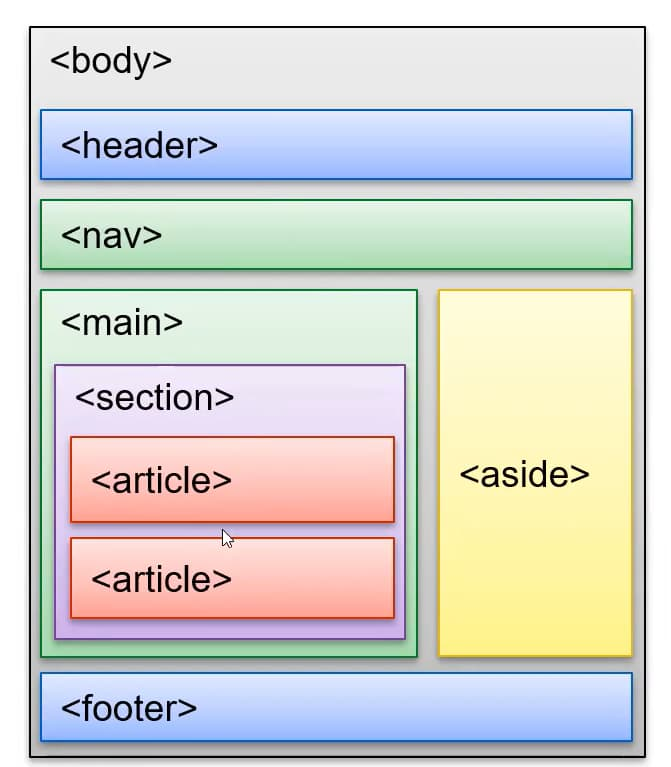
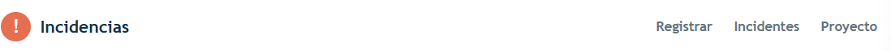
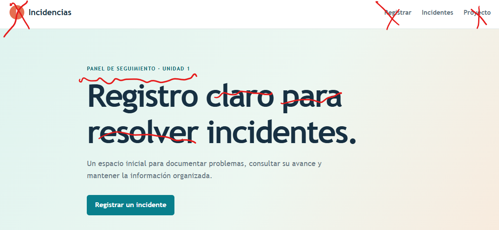

# **ASIGNATURA DE DESARROLLO BASADO EN PLATAFORMAS**
En el presente proyecto tenemos como finalidad implementar una aplicación web de acuerdo con el contenido revisado en la asignatura de desarrollo basado en plataformas
___

## DESARROLLO SEMANAS 1 Y 2

## Instrucciones T1S1

Desarrolle un proyecto que construya la primera versión de la interfaz web para una plataforma de gestión y monitoreo de incidentes de ciberseguridad.

El proyecto debe incluir:

1) estructura semántica HTML5 con header, nav, main, section, aside y footer;

2) formulario accesible para registrar incidentes con labels, ayudas contextuales y validación nativa;

3) listado simulado de incidentes y vista de detalle;

4) hoja CSS externa con box model, Flexbox, Grid y media queries;

5) evidencias de funcionamiento en escritorio y móvil;

6) justificación técnica de 600 a 800 palabras que explique cómo se aplicaron todos los temas y subtemas de la Unidad 1.

### Prompt Inicial
*"crea una página web agregando la estructura de la imagen, toma en cuenta que el propósito de la página es el siguiente: El proyecto debe incluir: **1)** estructura semántica HTML5 con header, nav, main, section, aside y footer; **2)** formulario accesible para registrar incidentes con labels, ayudas contextuales y validación nativa; **3)** listado simulado de incidentes y vista de detalle; **4)** hoja CSS externa con box model, Flexbox, Grid y media queries; **5)** evidencias de funcionamiento en escritorio y móvil; **6)** justificación técnica de 600 a 800 palabras que explique cómo se aplicaron todos los temas y subtemas de la Unidad 1. Por lo pronto solo crea algo, yo voy a corregirlo e irte guiando para que quede mejor, pero por ahora quiero tener un esqueleto"*

**Nota. -** El procedimiento adecuado sería utilizar herramientas de diseño de páginas web para determinar una interfaz preliminar. En honor al tiempo y practicar el uso de la inteligencia artificial para este propósito, vamos a tomar el diseño generado por el prompt y lo mejoraremos de manera progresiva. 

### Observaciones preliminares
Una vez utilizado un prompt personalizado obtendremos una página web preliminar. El procedimiento académico en este punto consiste en el aprendizaje con la práctica; en este sentido lo más coherente es explorar el código, entenderlo de manera íntegra, determinar un conjunto de observaciones preliminares, ya sean estas preferencias de diseño o funcionales, comprender cuáles son las porciones de código que tienen un efecto directo con estas observaciones y, finalmente, tratar todas las observaciones documentadas para el primer commit. Este proceso naturalmente se debe realizar en congruencia con las instrucciones para las tareas 1 y 2, adicionalmente el enfoque de crear el "esqueleto" del proyecto utilizando HTML y CSS hace que la primera entrega haga énfasis en qué elementos existen y cómo se verán, por lo que los cambios preliminares también se enfocarán únicamente en estos elementos del diseño:

* Nos vamos a guiar con la siguiente imagen para cumplir con la estructura

    

* La barra de navegación se encuentra pegada al lado derecho de la página. Voy a proceder a centrar esto y en la parte de la izquierda podemos incluir un logo del sistema.

* Ya existe un botón de registrar en la barra de navegación. Me parece correcto mantener únicamente uno pero ubicado en la parte más visible, puede ser en la parte superior izquierda o derecha y que en el futuro no regrese, no solo nos lleve a la sección de registro en la misma página sino que abra una ventana tipo "pop up", **para esta idea es necesario utilizar JavaScript por lo que quedará pendiente para los enfoques de las semanas futuras.**

* En relación al registro de los incidentes, la simulación generada es correcta pues para realizar el almacenamiento de la información ingresada necesitaremos JS o, idealmente, una base de datos para tener persistencia.

* Crearemos una imagen de un sistema ficticio para nuestro proyecto y este se mostrará siempre en la parte superior izquierda y reubicaremos el título de registro de incidencias, también eliminaremos texto innecesario y reduciremos el tamaño en general de esta sección de "hero".

* El logo que utilizaremos será el siguiente: 

    

Hay que notar que el código para este cambio refleja que es un enlace al inicio de la página. Esto realmente no es funcional por el momento hasta que podamos referenciar una página de inicio (para mi proyecto personal). 

* El contenido que se muestra en el panel lateral es responsivo y tentativamente debe mostrar una vista del ultimo ticket que haya generado el usuario. Por ahora el que se encuentra ahi esta correto, sin embargo, este elemento esta deslizandose de forma innecesaria hacia abajo conforme bajamos en la página asi que vamos a corregir este comportamiento.

## ENTREGA T1S1

En esta primera entrega hemos desarrollado el esqueleto de nuestro proyecto, la documentacion técnica ha sido generada y con lo desarrollado hasta este punto realizaremos el primer commit y push del proyecto. 
___