# **ASIGNATURA DE DESARROLLO BASADO EN PLATAFORMAS**
En el presente proyecto tenemos como finalidad implementar una aplicación web de acuerdo con el contenido revisado en la asignatura de desarrollo basado en plataformas
___

## DESARROLLO SEMANAS 1 Y 2

## Instrucciones T1S1

Desarrolle un proyecto que construya la primera versión de la interfaz web para una plataforma de gestión y monitoreo de incidentes de ciberseguridad.

El proyecto debe incluir:

1) estructura semántica HTML5 con header, nav, main, section, aside y footer;

2) formulario accesible para registrar incidentes con labels, ayudas contextuales y validación nativa;

3) listado simulado de incidentes y vista de detalle;

4) hoja CSS externa con box model, Flexbox, Grid y media queries;

5) evidencias de funcionamiento en escritorio y móvil;

6) justificación técnica de 600 a 800 palabras que explique cómo se aplicaron todos los temas y subtemas de la Unidad 1.

### Prompt Inicial
*"crea una página web agregando la estructura de la imagen, toma en cuenta que el propósito de la página es el siguiente: El proyecto debe incluir: **1)** estructura semántica HTML5 con header, nav, main, section, aside y footer; **2)** formulario accesible para registrar incidentes con labels, ayudas contextuales y validación nativa; **3)** listado simulado de incidentes y vista de detalle; **4)** hoja CSS externa con box model, Flexbox, Grid y media queries; **5)** evidencias de funcionamiento en escritorio y móvil; **6)** justificación técnica de 600 a 800 palabras que explique cómo se aplicaron todos los temas y subtemas de la Unidad 1. Por lo pronto solo crea algo, yo voy a corregirlo e irte guiando para que quede mejor, pero por ahora quiero tener un esqueleto"*

**Nota. -** El procedimiento adecuado sería utilizar herramientas de diseño de páginas web para determinar una interfaz preliminar. En honor al tiempo y practicar el uso de la inteligencia artificial para este propósito, vamos a tomar el diseño generado por el prompt y lo mejoraremos de manera progresiva. 

### Observaciones preliminares
Una vez utilizado un prompt personalizado obtendremos una página web preliminar. El procedimiento académico en este punto consiste en el aprendizaje con la práctica; en este sentido lo más coherente es explorar el código, entenderlo de manera íntegra, determinar un conjunto de observaciones preliminares, ya sean estas preferencias de diseño o funcionales, comprender cuáles son las porciones de código que tienen un efecto directo con estas observaciones y, finalmente, tratar todas las observaciones documentadas para el primer commit. Este proceso naturalmente se debe realizar en congruencia con las instrucciones para las tareas 1 y 2, adicionalmente el enfoque de crear el "esqueleto" del proyecto utilizando HTML y CSS hace que la primera entrega haga énfasis en qué elementos existen y cómo se verán, por lo que los cambios preliminares también se enfocarán únicamente en estos elementos del diseño:

* Nos vamos a guiar con la siguiente imagen para cumplir con la estructura

<p align="center">
    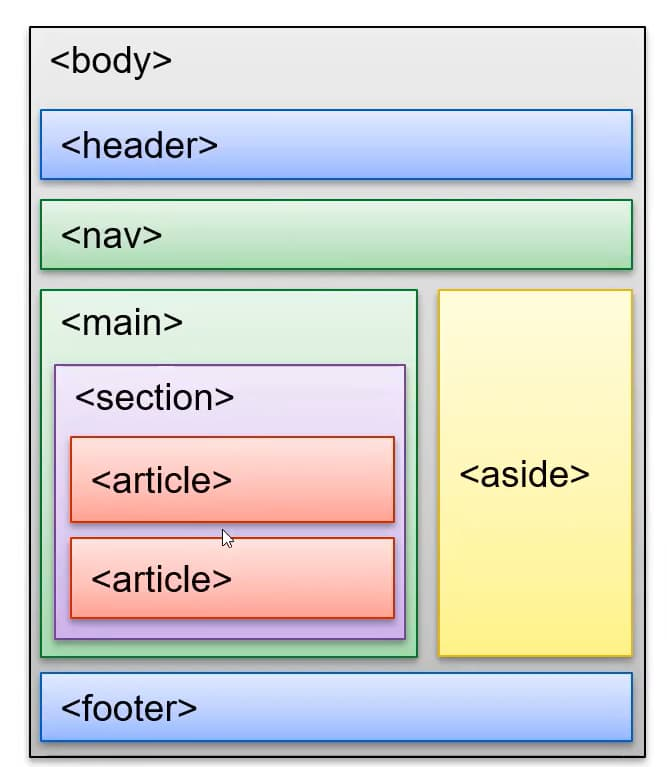
</p>

* La barra de navegación se encuentra pegada al lado derecho de la página. Voy a proceder a centrar esto y en la parte de la izquierda podemos incluir un logo del sistema.

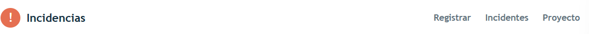

* Ya existe un botón de registrar en la barra de navegación. Me parece correcto mantener únicamente uno pero ubicado en la parte más visible, puede ser en la parte superior izquierda o derecha y que en el futuro no regrese, no solo nos lleve a la sección de registro en la misma página sino que abra una ventana tipo "pop up", **para esta idea es necesario utilizar JavaScript por lo que quedará pendiente para los enfoques de las semanas futuras.**

* En relación al registro de los incidentes, la simulación generada es correcta pues para realizar el almacenamiento de la información ingresada necesitaremos JS o, idealmente, una base de datos para tener persistencia.

* Crearemos una imagen de un sistema ficticio para nuestro proyecto y este se mostrará siempre en la parte superior izquierda y reubicaremos el título de registro de incidencias, también eliminaremos texto innecesario y reduciremos el tamaño en general de esta sección de "hero".

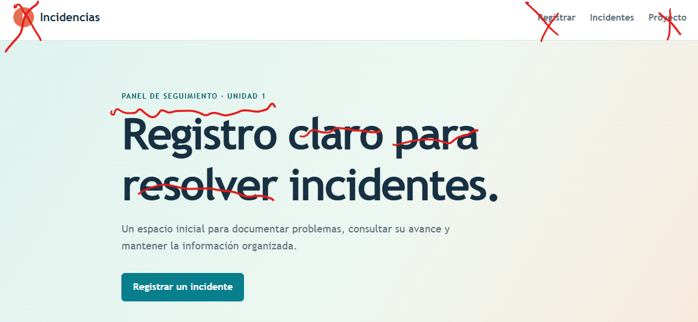

* El logo que utilizaremos será el siguiente: 

<p align="center">
    
</p>

Hay que notar que el código para este cambio refleja que es un enlace al inicio de la página. Esto realmente no es funcional por el momento hasta que podamos referenciar una página de inicio (para mi proyecto personal). 

* El contenido que se muestra en el panel lateral es responsivo y tentativamente debe mostrar una vista del ultimo ticket que haya generado el usuario. Por ahora el que se encuentra ahi esta correto, sin embargo, este elemento esta deslizandose de forma innecesaria hacia abajo conforme bajamos en la página asi que vamos a corregir este comportamiento.

## ENTREGA T1S1

En esta primera entrega hemos desarrollado el esqueleto de nuestro proyecto, la pagina web tiene una estructura sencilla y funcional de acuerdo con la lógica del proyecto a lo largo del curso y la documentacion técnica ha sido generada. Con lo desarrollado hasta este punto realizaremos el primer commit y push del proyecto. 
___

## Instrucciones T1S2

 Mejore el prototipo de la Unidad I incorporando JavaScript. Debe validar dinámicamente el formulario, renderizar incidentes simulados, consumir un archivo JSON o datos simulados con Fetch, anunciar mensajes con ARIA y organizar la lógica usando una separación tipo MVC.

## Enfoques de la mejora

* **Validar dinámicamente el formulario:** que el formulario le avise al usuario si algo está mal (un campo vacío, un correo mal escrito) mientras lo está llenando, no solo cuando intenta enviarlo.

El principal cambio aqui fue hacer que el formulario pueda s3er controlado con JavaScript, por lo que le agregamos un id para poder referenciarlo y tambien le agregamos el atributo de no validar ya que usariamos nuestros mensajes de error pesonalizados para cumplir con la validación segun las instrucciones. En este sentido, si intentamos registrar los datos ingresados en el formularios los mensajes de error se mostrarian de la siguiente manera:

<p align="center">
    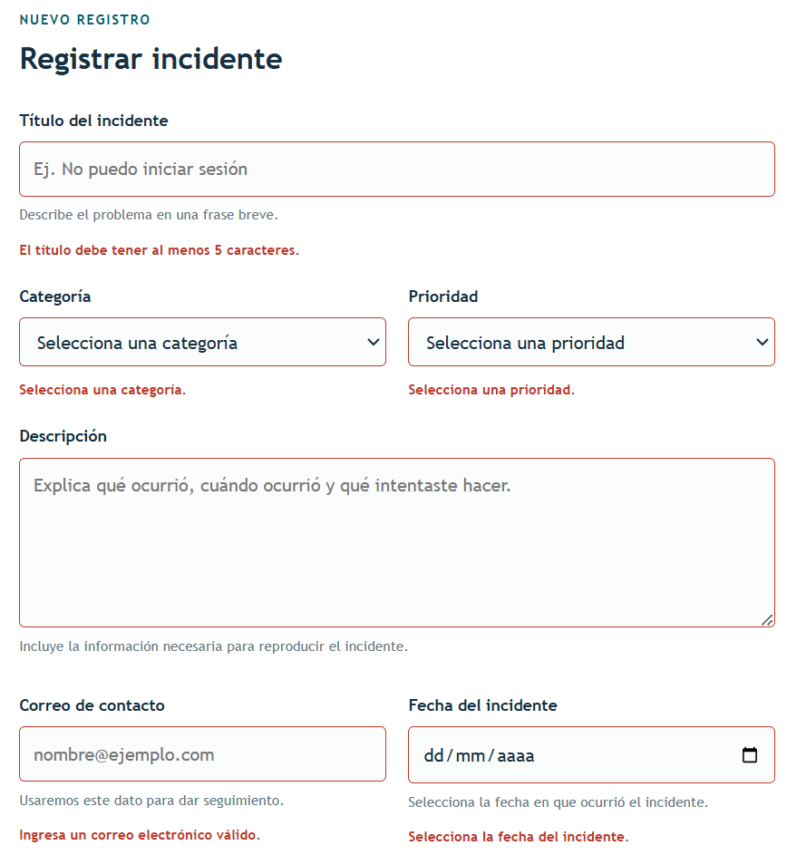
</p>

Hay que mencionar que utilizamos la propiedad "hidden" para que no se muestren por defecto estos mensajes sino hasta que falle la validacion al presionar el boton de registro. 

* **Renderizar incidentes simulados:** que la lista de incidentes ya no esté "quemada" a mano en el código, sino que aparezca en pantalla generada automáticamente a partir de los datos.

Antes, los 3 que habiamos determinado como ejemplo de como se visualizaria la página idealmente estaban escritos directamente en el HTML como texto fijo. Ahora, model.js guarda esos datos en una variable, y view.js tiene una función (renderList) que recorre esos datos con código y por cada incidente crea un bloque HTML nuevo (<article>) y lo mete en la página. El resultado es que podamos ver el registro como tal en la seccion "Incidentes  recientes" e, incluso, en el sidebar que muestra el ultimo ticket registrado (renderDetail).

**Ejemplo propuesto:**

<p align="center">
    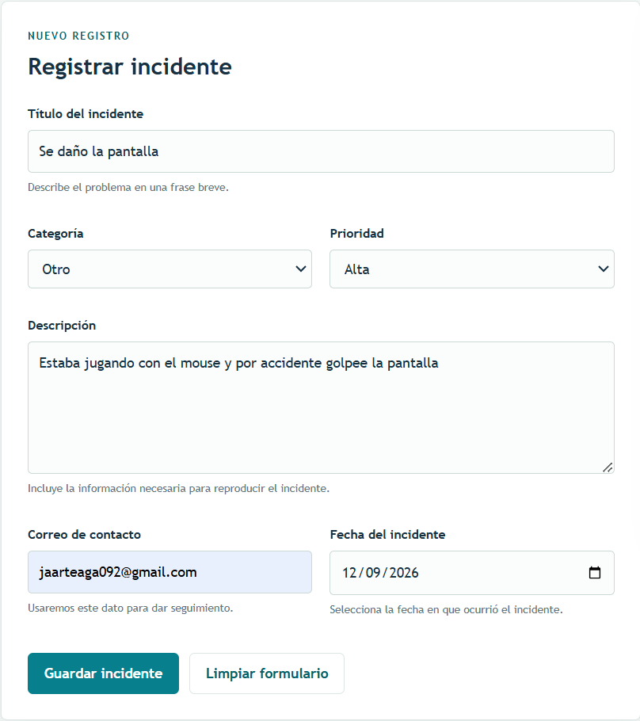
</p>

**Resultado en incidentes recientes:**

<p align="center">
    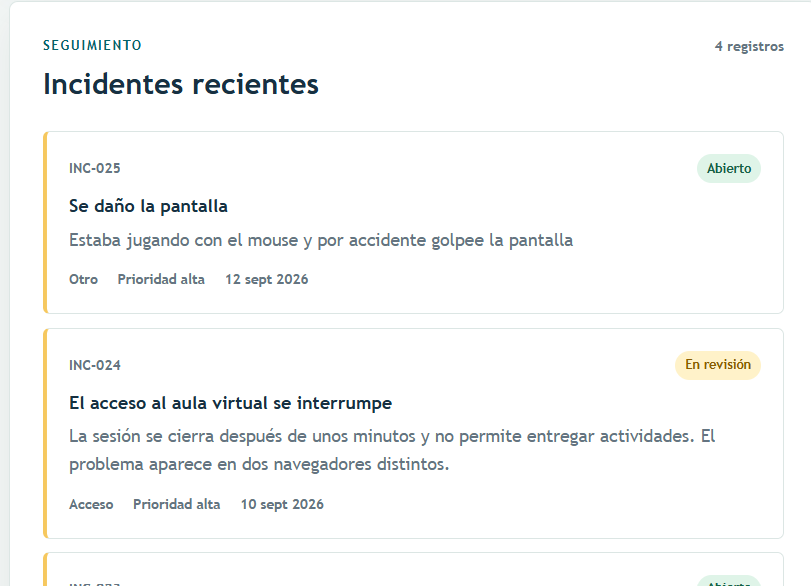
</p>

**Resultado en ultimo incidente:**

<p align="center">
    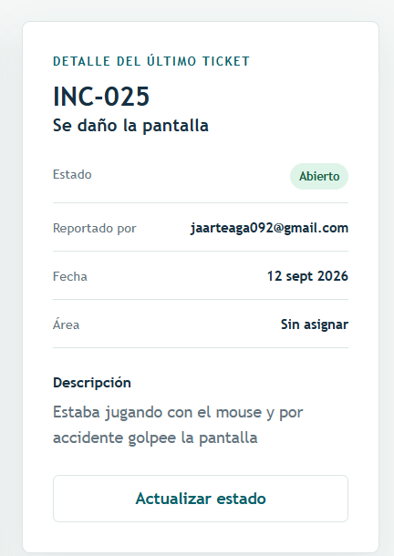
</p>

* **Consumir un JSON con Fetch:** que esos incidentes vengan de un archivo separado (como si fuera una mini base de datos), y que la página los "pida" y los cargue cuando se abre, en lugar de tenerlos escritos directamente adentro.

Creamos data/incidents.json, un archivo separado con los datos en formato JSON. En model.js, la función loadIncidents() usa fetch("data/incidents.json") para pedir ese archivo de forma **asíncrona** (como si fuera una petición a un servidor) y luego lo convierte en datos que JavaScript puede usar. Por eso necesitamos Live Serve ya que fetch no funciona abriendo el archivo con doble clic, necesita un servidor real sirviendo los archivos.

* **Anunciar mensajes con ARIA:** que cuando pase algo importante en la página (se registró un incidente, hay un error, se cargó la información), una persona que use lector de pantalla también se entere, aunque no pueda verlo.

* **Organización tipo MVC:** Nuestro proyecto se desarrolla ordenado en partes separadas según su función: una que maneja los datos, otra que maneja lo que se ve en pantalla, y otra que conecta ambas cuando el usuario hace algo. Así es más fácil de entender y de corregir después. Podemos constatar la manera en que hemos procedido hasta este momento: 

<p align="center">
    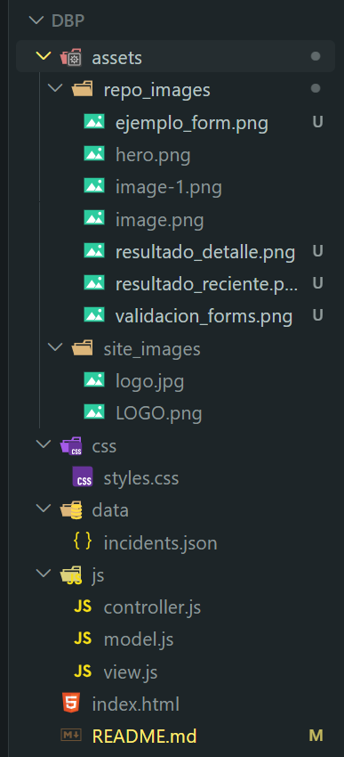
</p>

Notemos que la separacion de nuestros archivos de JS tienen el siguiente propósito:

* model.js responde: "¿cuáles son los datos?" (traerlos, guardarlos, agregar uno nuevo)
* view.js responde: "¿cómo se ve eso en pantalla?" (convertir datos en HTML)
* controller.js responde: "¿qué debe pasar cuando el usuario hace algo?" (clic, escribir, enviar) 

## ENTREGA T1S2

En esta segunda entrega hemos incorporado JavaScript al esqueleto desarrollado en la primera semana, dotando a la página web de validación dinámica, renderizado de datos mediante Fetch y anuncios accesibles con ARIA, todo organizado bajo una arquitectura tipo MVC de acuerdo con la lógica del proyecto a lo largo del curso. La documentación técnica correspondiente ha sido generada. Con lo desarrollado hasta este punto realizaremos el commit y push de esta segunda entrega.

___

## Instrucciones T1S3

Elabore un documento técnico breve y un prototipo mínimo que demuestre el flujo cliente-servidor. Debe incluir diagrama de componentes, roles, arquitectura n-capas, explicación de peticiones HTTP y un servidor básico Node.js que responda una ruta JSON.

## Enfoques de la mejora

* **Concepto de plataforma digital y componentes:** hasta la semana pasada, el proyecto funcionaba únicamente con Live Server, es decir, un servidor de archivos estáticos sin ninguna lógica detrás. Esta semana el objetivo fue incorporar un servidor propio construido con Node.js, que es lo que realmente convierte al proyecto en una plataforma con componentes diferenciados: cliente, servidor y datos, cada uno con su rol específico.

* **Servidor Node.js con módulo http nativo:** se creó el archivo app.js en la raíz del proyecto, usando únicamente el módulo http de Node (sin frameworks todavía, eso queda para la siguiente semana con Express). Este servidor es el que ahora sirve index.html, styles.css y los tres módulos de JavaScript, cumpliendo la misma función que antes hacía Live Server, pero de forma propia.

* **Servicios expuestos (rutas de la API):** se agregaron dos rutas nuevas: /api/salud, que simplemente confirma que el servidor está activo, y /api/incidentes, que lee el archivo data/incidents.json desde el servidor y lo entrega como respuesta. Estas rutas son los "servicios" de la plataforma: contratos claros mediante los cuales el cliente puede pedir información.

**Api de salud de la plataforma**

<p align="center">
    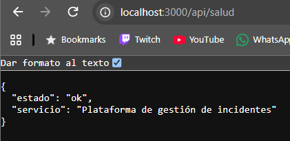
</p>

**Api de incidentes registrados**

<p align="center">
    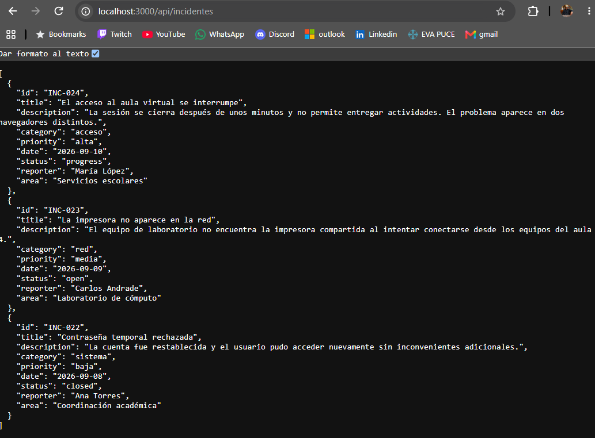
</p>

* **Cambio en el cliente (model.js):** el único ajuste necesario en el código que ya teníamos fue en model.js. Antes, loadIncidents() hacía fetch("data/incidents.json"), leyendo el archivo de forma directa. Ahora hace fetch("/api/incidentes"), pidiéndoselo al servidor en lugar de acceder al archivo directamente. view.js y controller.js no necesitaron ningún cambio, ya que no les importa de dónde vienen los datos, solo qué hacer con ellos una vez que llegan.

* **Arquitectura n-capas:** con el servidor ya en su lugar, el proyecto quedó organizado en tres capas claramente separadas: la capa de presentación (HTML, CSS y los archivos JS del cliente), la capa de lógica (app.js, que decide qué responder a cada petición) y la capa de datos (incidents.json). Como refuerzo de esta separación, el servidor bloquea el acceso directo a cualquier archivo dentro de la carpeta data, de modo que la única forma de obtener los incidentes es a través de la ruta /api/incidentes, nunca leyendo el archivo JSON de manera directa desde el navegador.

<p align="center">
    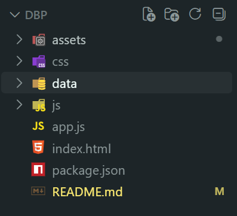
</p>

**Acceso bloqueado a la carpeta de "data"**

<p align="center">
    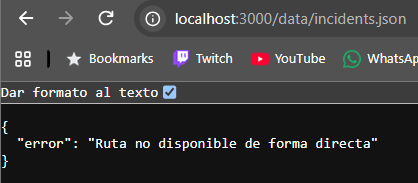
</p>

* **Peticiones HTTP:** todas las comunicaciones entre el cliente y el servidor se hacen mediante el método GET del protocolo HTTP. Cada respuesta incluye un código de estado: 200 cuando todo sale bien, y 404 cuando la ruta solicitada no existe o no está disponible (como es el caso del acceso directo a data). Se probó también una ruta inexistente para confirmar que el servidor responde con un error controlado en lugar de fallar.

<p align="center">
    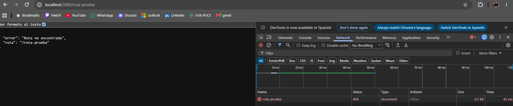
</p>

Es importante aclarar que esta semana el alcance fue únicamente demostrar el flujo cliente-servidor con peticiones GET. El formulario de registro sigue funcionando igual que en la entrega anterior: guarda el incidente en la memoria del navegador, pero no hay persistencia real todavía, ya que eso corresponde a la incorporación de Express y las rutas CRUD en la siguiente semana.

## ENTREGA T1S3

En esta tercera entrega incorporamos un servidor Node.js real al proyecto, reemplazando la función que antes cumplía Live Server. Se expusieron rutas de servicio (/api/salud y /api/incidentes), se reforzó la separación en arquitectura de n-capas restringiendo el acceso directo a los datos, y se documentó el flujo completo de peticiones HTTP entre el cliente y el servidor. La documentación técnica correspondiente ha sido generada. Con lo desarrollado hasta este punto realizaremos el commit y push de esta tercera entrega.
___

## Instrucciones T1S4

Implemente una API REST inicial para incidentes con Express y un front-end que consuma sus datos. Debe incluir rutas CRUD básicas, controladores, modelo en memoria, middleware de registro, manejo de errores y una interfaz que liste, filtre o cree incidentes mediante Fetch.

## Enfoques de mejora

Migración a Express.js: Se sustituyó el módulo http nativo por el framework Express.js, facilitando el enrutamiento modular, el procesamiento de cuerpos JSON mediante middleware nativo (express.json()) y el servicio de archivos estáticos (express.static).

Implementación de Rutas CRUD y Controladores: Se definieron endpoints RESTful completos para la entidad de incidentes (/api/incidentes):

- GET /api/incidentes: Obtención y filtrado de incidentes (por categoría, prioridad o estado).

- GET /api/incidentes/:id: Obtención del detalle de un incidente por identificador único.

- POST /api/incidentes: Creación de un nuevo incidente con asignación automática de ID y fecha.

- PUT /api/incidentes/:id: Actualización completa de la información de un incidente existente.

- DELETE /api/incidentes/:id: Eliminación física/lógica de un incidente por su ID.

**Modelo en Memoria:** Los incidentes se administran temporalmente en un arreglo de JavaScript en memoria inicializado a partir del archivo JSON, permitiendo mutaciones en tiempo de ejecución (crear, editar, eliminar) dentro de la sesión del servidor.

**Middlewares Personalizados:**

Middleware de Registro (Logger): Intercepta cada solicitud entrante imprimiendo en consola el método HTTP, la URL y la marca de tiempo.

Middleware de Manejo de Errores: Captura excepciones no controladas y devuelve respuestas JSON con código 500 Internal Server Error o validaciones de formato (400 Bad Request).

Integración con la Interfaz (Fetch API): El cliente consume dinámicamente los endpoints REST usando fetch(), permitiendo listar incidentes en tiempo real, aplicar filtros de búsqueda desde la interfaz y enviar nuevos registros sin recargar la página.

**Pruebas de endpoints CRUD con cliente HTTP: **

Aqui hicimos el ingreso de un incidente nuevamente para comprobar que el registro de hace a traves de una peticion al servidor.

<p align="center">
    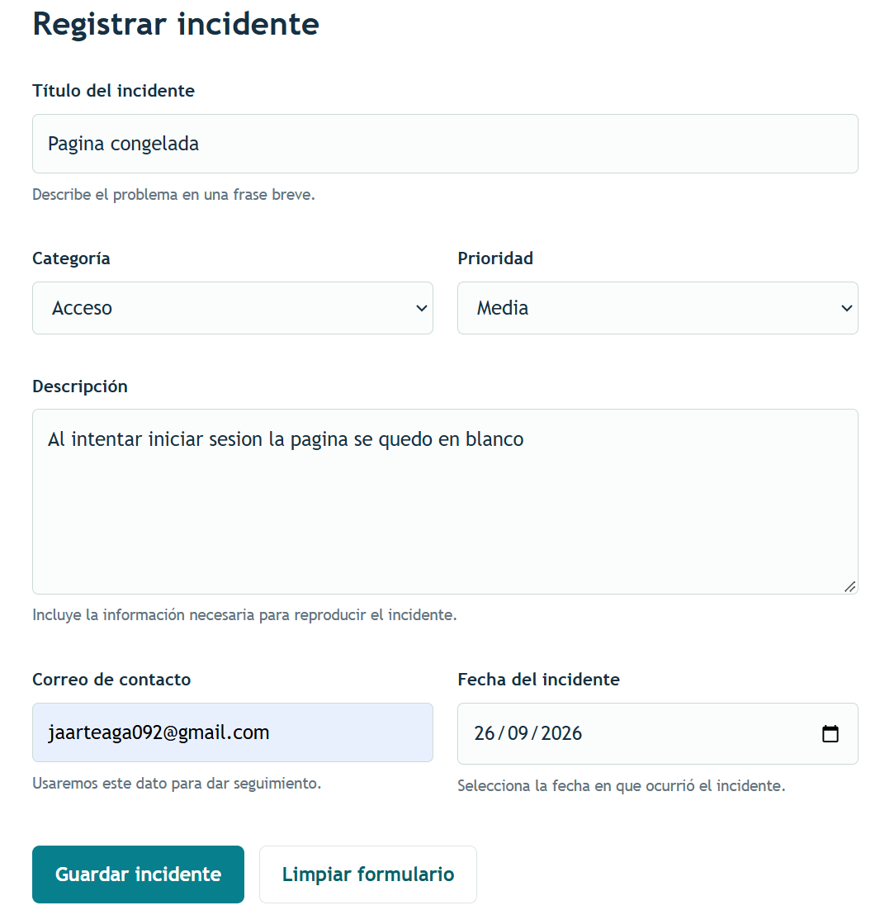
</p>

Comprobamos que el registro se realizo con una peticion de tipo POST al servidor para luego solicitar refrescar la lista que se mostraria en la pagina utilizado otra peticion, esta vez de tipo GET.

<p align="center">
    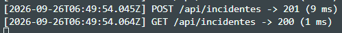
</p>

Asi mismo se implementaron filtros para, a traves de una peticion de tipo GET, encontrar los incidentes almacenados en el archiso de incidentes.json

<p align="center">
    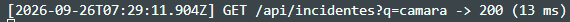
</p>

<p align="center">
    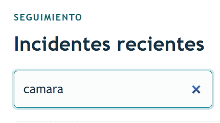
</p>

Tomar en consideracion que el hecho de que no se haya encontrado el incidente a traves del filtro, el mensaje 200 nos asegura que la peticion http se realizo de manera correcta.

A continuacion se evidencia la implementacion de lectura en el archivo model.js

```javascript
async function loadIncidents(filters = {}) {
  // Construye la URL con Query Parameters (ej: /api/incidentes?q=camara) como en el ejemplo anterior
  const queryParams = new URLSearchParams(filters).toString();
  const url = queryParams ? `/api/incidentes?${queryParams}` : '/api/incidentes';

  // Consumo asíncrono de la API REST
  const response = await fetch(url);
  if (!response.ok) throw new Error('Error al cargar incidentes');
  
  return await response.json(); // Convierte la respuesta JSON en objetos JS
}
```

Y tambien la integracion de la escritura utilizando POST

```javascript
async function createIncident(data) {
  const response = await fetch('/api/incidentes', {
    method: 'POST',
    headers: {
      'Content-Type': 'application/json' // Indica al backend que envía un JSON
    },
    body: JSON.stringify(data) // Transforma el objeto JS a cadena JSON
  });

  if (!response.ok) throw new Error('Error al registrar el incidente');
  return await response.json(); // Retorna el incidente creado con su ID
}
```
Tenemos tambien una simple implementacion de actualizacion utilizando peticiones PUT/PATCH con la posibilidad de cambiar el estado del ultimo ticket

## ENTREGA T1S4

En esta cuarta entrega consolidamos la integración entre el cliente web y el backend Express mediante una API RESTful completa. Se implementaron las peticiones asíncronas (GET, POST) utilizando Fetch API bajo el patrón MVC, asegurando el refresco dinámico de datos sin recargar la página. Además, se integraron middlewares de registro para auditoría de tráfico y control centralizado de errores, garantizando respuestas JSON con códigos HTTP adecuados (201, 200, 404). Se completó la modularización del proyecto respaldada por package.json y el control de versiones. Con lo desarrollado hasta este punto realizaremos el commit y push de esta cuarta entrega.

___
## Instrucciones T1S5

Amplíe la plataforma de incidentes del Reto 2. Reemplace el almacenamiento en memoria por una base de datos. Implemente conexión segura mediante variables de entorno, un modelo de Incidente, migraciones, CRUD persistente, filtros por estado o prioridad, validaciones y manejo central de excepciones. Pruebe los casos correctos y los errores. Entregue el código, el esquema, las migraciones, capturas de la base y un informe de 700 a 900 palabras que explique sus decisiones.

## Enfoques de mejora

**Base de datos elegida:** PostgreSQL 16 (SQL) ejecutándose en Docker, con el ORM **Sequelize**. Los incidentes tienen una estructura fija (título, prioridad, estado...), por eso un modelo relacional con restricciones es más adecuado que uno NoSQL de documentos.

| Antes (T1S4) | Ahora (T1S5) |
|---|---|
| Arreglo en memoria: se pierde al reiniciar | Tabla `incidents` en PostgreSQL: los datos persisten |
| Validación manual en el controlador | Validaciones en el modelo ORM + restricciones `CHECK` en la base |
| Funciones síncronas | Funciones `async/await` (la base responde por red) |
| Errores 400/404/500 | Manejo central: 400, 404, 409, 413, 500 y 503 según el tipo de excepción |

**Estructura nueva**

```
.env.example                 plantilla de variables (el .env real NO se sube a Git)
docker-compose.yml           PostgreSQL + Adminer (+ API opcional para el servidor)
Dockerfile                   imagen de la API para Ubuntu Server
.sequelizerc                 rutas que usa sequelize-cli
database/esquema.sql         esquema final de la tabla (pg_dump)
migrations/                  001 crea la tabla y CHECKs, 002 agrega índices
seeders/                     incidentes de ejemplo
scripts/pruebas.js           23 pruebas: casos correctos, errores y seguridad
src/config/config.js         lee la conexión desde variables de entorno
src/db/sequelize.js          crea el pool de conexiones
src/models/Incident.js       modelo ORM con validaciones
src/models/incidentModel.js  consultas (findAll, findByPk, create, save, destroy)
src/middleware/asyncHandler.js  envía los errores async al manejador central
```

**Seguridad aplicada**
- Credenciales solo en `.env` (ignorado por Git) y la app no arranca si faltan.
- PostgreSQL publicado solo en `127.0.0.1`: no queda expuesto a la red.
- Consultas parametrizadas del ORM: la búsqueda `' OR '1'='1` devuelve 0 resultados.
- Lista blanca de campos (evita asignación masiva) y validación del `id` y de los filtros.
- Escape de HTML en la vista para evitar XSS almacenado, ahora que los datos se guardan.
- Los errores no revelan SQL ni el stack trace al cliente; el detalle queda en el log.
- `express.json({ limit: "10kb" })` y `x-powered-by` desactivado.

## Cómo ejecutar

### Opción A: PC con Docker Desktop (desarrollo)

```bash
cp .env.example .env          # en Windows: copy .env.example .env  (y cambiar DB_PASSWORD)
docker compose up -d db adminer
npm install
npm run db:migrate            # crea la tabla
npm run db:seed               # carga datos de ejemplo
npm start                     # http://localhost:3000
npm run probar                # en otra terminal: ejecuta las 23 pruebas
```

Adminer (ver la base): http://localhost:8080 → Sistema *PostgreSQL*, Servidor `db`, usuario/clave/base del `.env`.

### Opción B: Ubuntu Server (todo en contenedores)

```bash
# en el servidor (una sola vez)
sudo apt update && sudo apt install -y docker.io docker-compose-v2 git
sudo usermod -aG docker $USER   # cerrar sesión y volver a entrar

git clone https://github.com/javieroel/DBP.git && cd DBP
cp .env.example .env && nano .env      # poner una clave fuerte
docker compose --profile full up -d --build   # base + adminer + API (migra al arrancar)
docker compose exec app npx sequelize-cli db:seed:all
docker compose logs -f app
```

La API queda en `http://IP_DEL_SERVIDOR:3000`. La base y Adminer solo escuchan en el propio servidor; para ver Adminer desde la PC se usa un túnel SSH:

```bash
ssh -L 8080:localhost:8080 usuario@IP_DEL_SERVIDOR    # luego abrir http://localhost:8080
```

Si el servidor usa firewall: `sudo ufw allow 3000/tcp` (no abrir 5432).

### Comandos útiles de migraciones

```bash
npm run db:migrate:status     # qué migraciones están aplicadas
npm run db:migrate:undo       # revierte la última
npm run db:reset              # revierte todo, migra y siembra de nuevo
```

## ENTREGA T1S5

En esta quinta entrega se reemplazó el modelo en memoria por PostgreSQL ejecutándose en Docker, accedido mediante el ORM Sequelize. Se definió el modelo `Incident` con validaciones, dos migraciones versionadas, un seeder, CRUD persistente con filtros por estado y prioridad, conexión configurada por variables de entorno y un manejador central que traduce cada excepción a su código HTTP. El script `npm run probar` verifica 23 casos correctos, de error y de seguridad.

___
